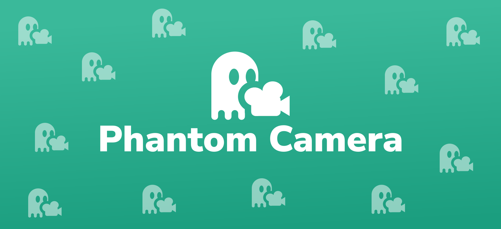

<h1>Phantom Camera</h1>

    Control and dynamically tween 2D and 3D cameras between various positional and rotational values in Godot 4.

<table>
  <tr>
    <th>Wiki Page</th>
    <th>Roadmap</th>
  <tr>
  <tbody>
  <tr>
    <td width="1200" align="center" valign="top">
      
    </td>
     <td width="1200" align="center" valign="top">
      
    </td>
  </tbody>
</table>

# Features

<h3>
    <a href="https://github.com/ramokz/phantom-camera/wiki/Properties:-Priority-(2D-&-3D)">Priority</a>
</h3>

Determines which <code>PhantomCamera</code> should be active with the <code>Camera2D</code>/<code>Camera3D</code>.

When a new camera recieves a higher priority than currently active <code>PhantomCamera</code> the <code>Camera2D</code>/<code>Camera3D</code> will seamlessly transition to the new one.

<h3>
<a href="https://github.com/ramokz/phantom-camera/wiki/Properties:-Follow-(2D-&-3D)">Follow Mode</a>
</h3>

Define how the <code>Camera2D</code>/<code>Camera3D</code> should follow, or reposition based on, its target(s).

<a href="https://github.com/ramokz/phantom-camera/wiki/Properties:-Follow-(2D-&-3D)#glued">
  <h4>Glued</h4>
</a>

  Sticks to its target.

 

<a href="https://github.com/ramokz/phantom-camera/wiki/Properties:-Follow-(2D-&-3D)#simple">
  <h4>Simple</h4>
</a>

  Follows the target with an optional offset and damping.

<table>
    <thead>
        <tr>
            <th align="center" valign="top" width="2000">
              
               
              <b>PhantomCamera2D</b>
            </th>
            <th align="center" valign="top" width="2000">
              
               
              <b>PhantomCamera3D</b>
            </th>
        </tr>
    </thead>
    <tr>
        <td align="center">      
            <video src="https://user-images.githubusercontent.com/5159399/226146668-48f8a24c-cdf9-4977-a9a1-76388b1532c8.mp4"/> 
        </td>
        <td align="center">
            <video src="https://user-images.githubusercontent.com/5159399/226146678-83243b53-4dfe-4cb6-8604-0a13fed04ea0.mp4"/>
        </td>
    </tr>
</table>

 

<a href="https://github.com/ramokz/phantom-camera/wiki/Properties:-Follow-(2D-&-3D)#group">
  <h4>Group</h4>
</a>

  Follows the centre of a collection of targets.

<table>
    <thead>
        <tr>
            <th align="center" valign="top" width="2000">
              
               
              <b>PhantomCamera2D</b>
            </th>
            <th align="center" valign="top" width="2000">
              
               
              <b>PhantomCamera3D</b>
            </th>
        </tr>
    </thead>
    <tr>
        <td align="center">
            <video src="https://user-images.githubusercontent.com/5159399/226145332-9766cbe0-8807-4a65-ad07-8d2e6186bc97.mp4"/>
        </td>
        <td align="center">
            <video src="https://user-images.githubusercontent.com/5159399/226146299-e0522e2f-b0e5-4d56-a58a-e3ef5b24f383.mp4"/>
        </td>
    </tr>
</table>

 

<a href="https://github.com/ramokz/phantom-camera/wiki/Properties:-Follow-(2D-&-3D)#group">
  <h4>Path</h4>
</a>

  Follows a target while being positionally confined to a Path node.

<table>
    <thead>
        <tr>
            <th align="center" valign="top" width="2000">
              
               
              <b>PhantomCamera2D</b>
            </th>
            <th align="center" valign="top" width="2000">
              
               
              <b>PhantomCamera3D</b>
            </th>
        </tr>
    </thead>
    <tr>
        <td align="center">
            <video src="https://user-images.githubusercontent.com/5159399/228355571-16ad5324-27b0-4952-a8c2-eff5b011494a.mp4"/>
        </td>
        <td align="center">
            <video src="https://user-images.githubusercontent.com/5159399/228356217-7c7f239e-2d3a-46e2-becd-cb7230d1e3e7.mp4"/>
        </td>
    </tr>
</table>

<h3>
<a href="https://github.com/ramokz/phantom-camera/wiki/Properties:-Zoom-(2D)">Zoom (2D)</a>
</h3>

Define the Zoom level for the <code>Camera2D</code>.

<table>
    <thead>
        <tr>
            <th align="center" valign="top" width="2000">
              
               
              <b>PhantomCamera2D</b>
            </th>
            <th align="center" valign="top" width="2000">
              
               
              <b>PhantomCamera3D</b>
            </th>
        </tr>
    </thead>
    <tr>
        <td align="center">
            <video src="https://user-images.githubusercontent.com/5159399/226146048-adb853ff-0f5e-4cac-bb7c-900d95486505.mp4"/>
        </td>
        <td align="center" valign="center">
            Not available in 3D
        </td>
    </tr>
</table>

<h3>
<a href="https://github.com/ramokz/phantom-camera/wiki/Properties:-Look-At-(3D)">Look At (3D)</a>
</h3>

Defines where the <code>Camera3D</code> should be looking—adjusting its rotational value.

 
<a href="https://github.com/ramokz/phantom-camera/wiki/Properties:-Look-At-(3D)#mimic">
<b>Mimic</b>
</a>

Copies the rotational value of its target.

 

 
<a href="https://github.com/ramokz/phantom-camera/wiki/Properties:-Look-At-(3D)#simple">
<b>Simple</b>
</a>

Looks At the target with an optional offset.

<table>
    <thead>
        <tr>
            <th align="center" valign="top" width="2000">
              
               
              <b>PhantomCamera2D</b>
            </th>
            <th align="center" valign="top" width="2000">
              
               
              <b>PhantomCamera3D</b>
            </th>
        </tr>
    </thead>
    <tr>
        <td align="center">      
            Not available in 2D
        </td>
        <td align="center">
            <video src="https://user-images.githubusercontent.com/5159399/226205072-bb3a7865-fb33-443e-a849-cf7c8305919f.mp4"/>
        </td>
    </tr>
</table>

 

<a href="https://github.com/ramokz/phantom-camera/wiki/Properties:-Look-At-(3D)#group">
 
  
 <b>Group</b>
</a>

 Looks at the centre of a collection of targets.

<table>
    <thead>
        <tr>
            <th align="center" valign="top" width="2000">
              
               
              <b>PhantomCamera2D</b>
            </th>
            <th align="center" valign="top" width="2000">
              
               
              <b>PhantomCamera3D</b>
            </th>
        </tr>
    </thead>
    <tr>
        <td align="center">      
            Not available in 2D
        </td>
        <td align="center">
            <video src="https://user-images.githubusercontent.com/5159399/226199734-f2657feb-e892-47cd-9255-607d1fa85f6d.mp4"/>
        </td>
    </tr>
</table>

<h3>
<a href="https://github.com/ramokz/phantom-camera/wiki/Properties:-Tween-(2D-&-3D)">Tween</a>
</h3>

Tweak how the <code>Camera2d</code>/<code>Camera3D</code> tweens to a newly active <code>PhantomCamera</code>.

<table>
    <thead>
        <tr>
            <th align="center" valign="top">
              
               
              <b>PhantomCamera2D</b>
            </th>
            <th align="center" valign="top">
              
               
              <b>PhantomCamera3D</b>
            </th>
        </tr>
    </thead>
    <tr>
        <td align="center">      
            <video src="https://user-images.githubusercontent.com/5159399/226145076-300ad120-b52a-4636-87de-309270f9e6c6.mp4"/> 
        </td>
        <td align="center">
            <video src="https://user-images.githubusercontent.com/5159399/226145029-d4a05ea8-0a0b-464f-a045-3fd562b1855f.mp4"/>
        </td>
    </tr>
</table>

## 📔 Deep Dive & How to use

See the [Phantom Camera - Wiki](https://github.com/ramokz/phantom-camera/wiki).

### 🪀 Example Scenes

A 2D and 3D example scenes can be found inside `res://addons/phantom_camera/examples` titled `2DExampleScene`
and `3DExampleScene` respectively.

## 💾 Installation

1. Download the repo and copy `addons/phantom_camera` to your root Godot directory under `res://`.
2. Enable the plugin inside `Project/Project Setttings/Plugins`
3. And that's it!
   For more help,
   see [Godot's official documentation](https://docs.godotengine.org/en/stable/tutorials/plugins/editor/installing_plugins.html)

## 📖 Roadmap

See the [project page](https://github.com/users/ramokz/projects/3/views/8) for upcoming features.

## FAQ

### _What is the intent behind the plugin?_

Cameras are an essential part of practically any game for rendering what you see on the screen. But rarely do they
remain static and immovable, but instead dynamic and changes based on what happens in the game.

The plugin is meant to simplify some common camera behaviour, such as smoothly moving between different points in space
at specified points in time or retain a particular positional/rotational value relative to other elements.

The end goal is to make it functional enough to become a generalised camera extension for Godot projects.

### _What is the state of the plugin?_

Ongoing, but still in early stages. Core features have been implemented, but may change as more get added. Things will
likely break or change along the way. It's also worth keeping in mind that lots of key and, likely, frequently used
features are yet to be done.

See the [project page](https://github.com/users/ramokz/projects/3/views/8) to see planned features.

### _Does this work for Godot 3.5 or older?_

Unfortunately not.

GDScript has received a lot of changes and improvements in 4.0, but as a result it would require a rather large rewrite
to make it compatible with older versions.

### _When will X feature be added?_

There's no deadline or precise timeframe for when things get implemented.
The [milestones page](https://github.com/MarcusSkov/phantom-camera/milestones) should give a good idea for what has,
will, and currently being looked at.

## Contribution

Issues, PRs, suggestions and feedback are welcome. Please create an Issue for bugs or a Discussion post for suggestions
or general discussions.

## Credits

- [Unity's Cinemachine Package](https://unity.com/unity/features/editor/art-and-design/cinemachine) for the key
  inspiration
- [Godot](https://godotengine.org/) for their amazing work creating the engine

[MIT License](https://github.com/ramokz/phantom-camera/blob/main/LICENSE)
