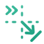

# Third Person Follow
As the name implies, this mode is meant to be used for third person camera experiences. It works by applying a `SpringArm3D` where the properties, such as `Collison Mask`, `Spring Length` and `Margin`, can be controlled from the `PCam3D`.

To adjust the orbit rotation around the target, the PhantomCamera3D uses the setter function `set_third_person_rotation()` (radians) or `set_third_person_rotation_degrees()` (degrees).

## Example Setup
```gdscript
var mouse_sensitivity: float = 0.05

var min_yaw: float = -89.9
var max_yaw: float = 50

var min_pitch: float = 0
var max_pitch: float = 360

func _unhandled_input(event) -> void:
  # Trigger whenever the mouse moves.
  if event is InputEventMouseMotion:
    var pcam_rotation_degrees: Vector3

    # Assigns the current 3D rotation of the SpringArm3D node - so it starts off where it is in the editor.
    pcam_rotation_degrees = pcam.get_third_person_rotation_degrees()

    # Change the X rotation.
    pcam_rotation_degrees.x -= event.relative.y * mouse_sensitivity
		
    # Clamp the rotation in the X axis so it go over or under the target.
    pcam_rotation_degrees.x = clampf(pcam_rotation_degrees.x, min_yaw, max_yaw)

    # Change the Y rotation value.
    pcam_rotation_degrees.y -= event.relative.x * mouse_sensitivity
		
    # Sets the rotation to fully loop around its target, but without going below or exceeding 0 and 360 degrees respectively.
    pcam_rotation_degrees.y = wrapf(pcam_rotation_degrees.y, min_pitch, max_pitch)
		
    # Change the SpringArm3D node's rotation and rotate around its target.
    pcam.set_third_person_rotation_degrees(pcam_rotation_degrees)
```

## Properties

<!--@include: ./parts/follow-mode.md-->

<!--@include: ./parts/follow-target.md-->

<!--@include: ./parts/follow-offset.md-->

<!--@include: ./parts/damping.md-->

<!--@include: ./parts/damping-value.md-->

<Property propertyName="Spring Length" propertyType="float" propertyDefault="1.0">
<template v-slot:propertyDescription>

Defines the `SpringArm3D` node's length.

</template>
<template v-slot:setMethod>

`void` set_spring_arm_spring_length(`float` length)

</template>
<template v-slot:setExample>

::: details Example
```gdscript
pcam.set_spring_arm_spring_length(4.2)
```
:::

</template>
<template v-slot:getMethod>

`float` get_spring_arm_spring_length()

</template>
<template v-slot:getExample>

::: details Example
```gdscript
pcam.get_spring_arm_spring_length()
```
:::

</template>
</Property>

<Property propertyName="Collision Mask" propertyType="int" propertyDefault="1">
<template v-slot:propertyDescription>

Defines the `SpringArm3D` node's Collision Mask.

</template>
<template v-slot:setMethod>

`void` set_spring_arm_collision_mask(`int` mask_int)

</template>
<template v-slot:setExample>

::: details Example
```gdscript
pcam.set_spring_arm_collision_mask(4)
```
:::

</template>
<template v-slot:getMethod>

`float` get_spring_arm_collision_mask()

</template>
<template v-slot:getExample>

::: details Example
```gdscript
pcam.get_spring_arm_collision_mask()
```
:::

</template>
</Property>

<Property propertyName="Shape" propertyType="Shape3D" propertyDefault="null">
<template v-slot:propertyDescription>

Defines the `SpringArm3D` node's `Shape3D`.

</template>
<template v-slot:setMethod>

`void` set_spring_arm_shape(`Shape3D` shape)

</template>
<template v-slot:setExample>

::: details Example
```gdscript
pcam.set_spring_arm_shape(shape)
```
:::

</template>
<template v-slot:getMethod>

`float` get_spring_arm_shape()

</template>
<template v-slot:getExample>

::: details Example
```gdscript
pcam.get_spring_arm_shape()
```
:::

</template>
</Property>

<Property propertyName="Margin" propertyType="float" propertyDefault="0.01">
<template v-slot:propertyDescription>

Defines the `SpringArm3D` node's Margin.

</template>
<template v-slot:setMethod>

`void` set_spring_arm_margin(`float` margin)

</template>
<template v-slot:setExample>

::: details Example
```gdscript
pcam.set_spring_arm_margin(0.42)
```
:::

</template>
<template v-slot:getMethod>

`float` get_spring_arm_margin()

</template>
<template v-slot:getExample>

::: details Example
```gdscript
pcam.get_spring_arm_margin()
```
:::

</template>
</Property>

<Property propertyName="Third Person Rotation" propertyType="Vector3" propertyDefault="Vector3(0,0,0)">
<template v-slot:propertyDescription>

Defines the rotation (in radians) value of the Third Person `SpringArm` node.

</template>
<template v-slot:setMethod>

`void` set_third_person_rotation(`Vector3` spring_arm_rotation)

</template>
<template v-slot:setExample>

::: details Example
```gdscript
pcam.set_third_person_rotation(Vector3(-30, 0, 0))
```
:::

</template>
<template v-slot:getMethod>

`Vector3` get_third_person_rotation()

</template>
<template v-slot:getExample>

::: details Example
```gdscript
pcam.get_third_person_rotation()
```
:::

</template>
</Property>

<Property propertyName="Third Person Rotation Degrees" propertyType="Vector3" propertyDefault="Vector3(0,0,0)">
<template v-slot:propertyDescription>

Defines the rotation (in degrees) value of the Third Person `SpringArm` node.

</template>
<template v-slot:setMethod>

`void` set_third_person_rotation_degrees(`Vector3` spring_arm_rotation)

</template>
<template v-slot:setExample>

::: details Example
```gdscript
pcam.set_third_person_rotation_degrees(Vector3(-30, 0, 0))
```
:::

</template>
<template v-slot:getMethod>

`Vector3` get_third_person_rotation_degrees()

</template>
<template v-slot:getExample>

::: details Example
```gdscript
pcam.get_third_person_rotation_degrees()
```
:::

</template>
</Property>