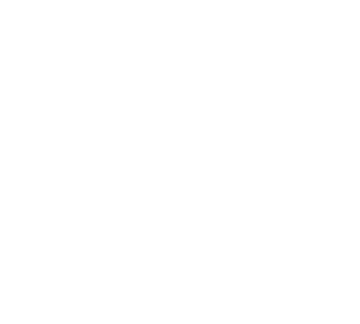

# Getting Started

## What is this plugin?
`Phantom Camera` is a Godot 4 plugin designed to provide and simplify common behaviors for the built-in `Camera2D` and `Camera3D` nodes - heavily inspired by a Unity package called [Cinemachine](https://unity.com/unity/features/editor/art-and-design/cinemachine).

It allows for simple behaviours such as follow or look at specific nodes with an optional smooth/dampened movement.
 
To more advance logic like reframing itself to keep multiple nodes in view and dynamically animate between specific camera positions, i.e. other PhantomCamera nodes, on demand.

## Phantom Camera
Is the primary node type for this plugin and the one that needs to be actively used.

Its purpose is to contain the positional and rotational data that should be applied to a scene's Camera2D/Camera3D. Because multiple of these can exist in a given scene, it doesn't communicate directly to a Camera2D/Camera3D. Instead, it sends signals to the scene's PhantomCameraHost. The PhantomCameraHost then determines which PhantomCamera should be followed and relays that to the Camera2D/Camera3D.

## Structure Example

## 💾 Installation

### Asset Library (Recommended, Stable)
1. In Godot, open the AssetLib tab.
2. Search for and select "Phantom Camera".
3. Download then install the plugin (be sure to only select the phantom_camera directory).
4. Enable the plugin inside Project/Project Setttings/Plugins.

### GitHub Release (Recommended, Stable)
1. Download a [release build](https://github.com/ramokz/phantom-camera/releases/).
2. Extract the zip file and move the addons/phantom_camera directory into the project root location. 
3. Enable the plugin inside Project/Project Setttings/Plugins.

### GitHub Branch (Latest, Unstable)