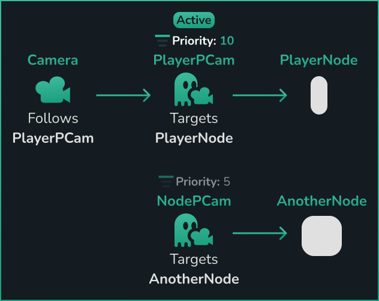

# Getting Started

## What is this addon?

<video controls>
<source src="../assets/videos/feature-overview.mp4">
</video>

`Phantom Camera` is a Godot 4 addon designed to provide and simplify common behaviors for the built-in `Camera2D` and `Camera3D` (`Camera`) nodes - heavily inspired by a Unity package called [Cinemachine](https://unity.com/unity/features/editor/art-and-design/cinemachine).

It allows for simple behaviours such as follow or look at specific nodes with an optional smooth/dampened movement.
 
To more advance logic like re-framing itself to keep multiple nodes in view and dynamically animate between specific camera positions, i.e. other PhantomCamera nodes, on demand.

## Nodes

### Phantom Camera
Shortened to `PCam` (text) and `pcam` (code) is the primary node type for this addon.

Its purpose is to contain the positional, rotational, tween and other data that should be applied to a scene's `Camera`. Upon a `PCam` becoming active it will effectively take over the scene's `Camera` node. Moving that `PCam` node then directly affects the `Camera`.

Because multiple of these can exist in a given scene, it doesn't communicate directly to a `Camera`. Instead, it sends signals to the scene's `PhantomCameraHost` (below), which handles transferring the information from the `PCam` to the `Camera` node. The `PhantomCameraHost` then determines which `PCam` should be followed and relays that to the Camera2D/Camera3D.

### Phantom Camera Host
Manages a scene's `PCam` and `Camera`. This node decides which `PCam` the `Camera` should be attached to and, consequently, what logic is should have. For all intents and purposes, it's a set and forget node once it's a child of a `Camera` node.

## Priority

Priority is one of the core properties of the plugin. Changing it tells the Camera2D/Camera3D which PhantomCamera should control it.

This is also how to tween, or interpolate, between different PhantomCameras. See the Tween page for more on this.

## Scene Requirement

To get started with the addon, the scene will need the below basic setup:

- `Camera2D`/`Camera3D` - ideally without a parent node except for the scene's root.
- `PhantomCameraHost`, as a child of the `Camera2D`/`Camera3D`. 
- `PhantomCamera2D`/`PhantomCamera3D` - ideally without a parent node except for the scene's root.

After this, the scene is then meeting the minimum requirements and you can now use the `PCam` however you wish!

## How does a Phantom Camera take control of a Camera?
When multiple `PCams` are in a given scene, the `Priority` property is what determines which one controls the `Camera` node. The one with the highest value becomes the active, and therefore controlling, `PCam`.

Switching a `PCam`'s priority can be done either from either the inspector within the editor or via code (see the [Priority page](../priority) for more on that.)
This is also how to tween, or interpolate, between different PhantomCameras. See the Tween page for more on this.

### Example

## 💾 Installation

### Asset Library (Recommended, Stable)
1. In Godot, open the `AssetLib` tab.
2. Search for and select "Phantom Camera".
3. Download then install the plugin.
4. Enable the plugin inside `Project/Project Settings/Plugins`.

### GitHub Release (Recommended, Stable)
1. Download a [release build](https://github.com/ramokz/phantom-camera/releases/).
2. Extract the zip file and move the `addons/phantom_camera` directory into the project root location. 
3. Enable the plugin inside `Project/Project Settings/Plugins`.

### GitHub Branch (Latest, Unstable)
1. Download the [latest main branch](https://github.com/ramokz/phantom-camera/archive/refs/heads/main.zip).
2. Extract the zip file and move the `addons/phantom_camera` directory into project's root location.
3. Enable the plugin inside `Project/Project Settings/Plugins`.

## Example Scenes
Scenes demonstrating different features can be found in the addon under `addons/phantom_camera/examples/example_scenes`.