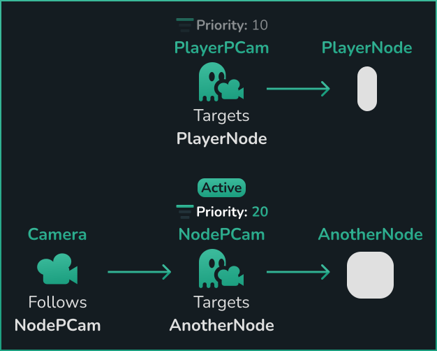

# Multiple Phantom Cameras
When multiple `PCams` are in a given scene, the `Priority` property is what determines which one controls the `Camera` node. The one with the highest value becomes the active, and therefore controlling, `PCam`.

Switching a `PCam`'s priority can be done either from either the inspector within the editor on the individual `PCam`, or via code - see the [Priority page](../priority) for more.
Changing this property is also what triggers a tween, or interpolation, between different PhantomCameras - see the [Tween page](../tween) for more.

## Example

_PlayerPCam has the highest Priority at 10_

_NodePCam now has the highest Priority at 20_