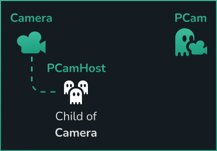

# Scene Requirement

Once installed, and to get started with the addon, a given 2D/3D scene will need the below minimum setup:

- A `Camera2D`/`Camera3D` node
  - Without a parent node _except_ for the scene's root.
- A`PhantomCameraHost` node
  - As a child of the `Camera2D`/`Camera3D`.
- At least one`PhantomCamera2D`/`PhantomCamera3D` node
  - Without a parent node _except_ for the scene's root.

After this, the scene is now meeting the minimum requirements, where as you move the `PhantomCamera` around the `Camera` is now following it.

## What now?
Explore the various properties and built-in behaviours on the `PhantomCameras`, such as the various [Follow Modes](../follow-modes/overview.md), and find an approach that suits your needs. Alternatively, keep on reading about the [Core Nodes](../core-nodes/overview) in the next page.