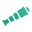

# Look At Overview (3D)

Modifies the rotational value of the `Camera3D`.

## Core Modes

<PropertyCore propertyName="Glued" propertyPageLink="./mimic" propertyIcon="./../../assets/look-at-mimic.svg">
<template v-slot:propertyDescription>

The simplest of the available options. Effectively copies the rotational value of the targeted `Node3D`.

</template>
</PropertyCore>
<PropertyCore propertyName="Simple" propertyPageLink="./simple" propertyIcon="./../../assets/look-at-simple.svg">
<template v-slot:propertyDescription>

Similar to `Mimic`, but allows for offsetting the position that is being looked at.

</template>
</PropertyCore>
<PropertyCore propertyName="Group" propertyPageLink="./group" propertyIcon="./../../assets/look-at-group.svg">
<template v-slot:propertyDescription>

Allows for multiple targets to be looked at. The camera will look at the centre of the assigned targets' `Vector3` coordinate.

</template>
</PropertyCore>

